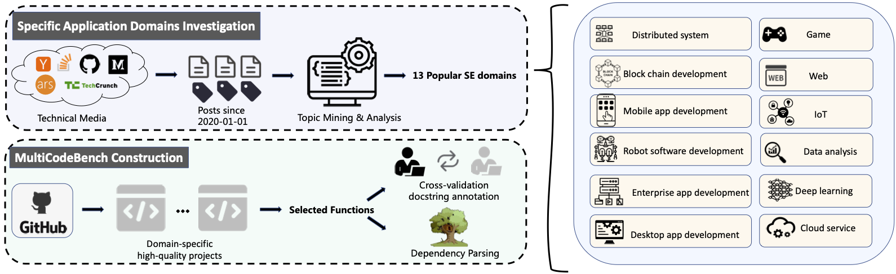
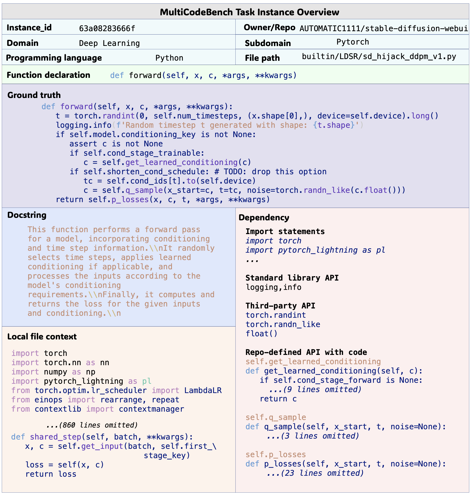

# 🔥 Code and data for our paper "How Well Do LLMs Generate Code for Different Application Domains? Benchmark and Evaluation"

## 💡 Overview
In this paper, we propose MultiCodeBench, a new multi-domain, multi-language code generation benchmark.
>We find that previous code generation benchmarks focus on general-purpose programming tasks, leaving LLMs' domain-specific programming capabilities to be unkonwn. To fill this gap, we construct MulticodeBench according to the following process to reveal the code generation capabilities of today's mainstream LLMs in popular software application domains.


Here is an example of a task instance in MultiCodeBench:


## ⚡️ Quick Start
1. clone this reposiotry.
2. run `conda env create -f environment.yml` to create a conda environment named MultiCodeBench.

## 🚀 Evaluation
- evaluation
  - CodeBleu: contains the entire set of evaluation tools of MulticodeBench
    - keywords: In CodeBLEU, keywords improve similarity accuracy by aligning assessment with code syntax and semantics.
    - parser
      - build
      - DFG: contains data flow graph extraction tools for all the covered languages
      - vendor
      - utils.py
    - bleu.py
    - calc_code_bleu.py
    - dataflow_match.py
    - syntax_match.pycode
    - utils.py
    - weighted_ngram_match.py
    - run_script.sh


To run evaluation on MultiCodeBench, you can put your generated results in the `generation_result` folder, following the format: `generation_result/docststring_only/{model_name}`, and run the following command in the `MultiCodeBench/evaluation/CodeBleu` directory: 
```
python calc_code_bleu.py --model {model_name}  --predict_result_base_path generation_result/docstring_only  

```
Or you can just modify the source code in `MultiCodeBench/evaluation/CodeBleu/calc_code_bleu.py` to define the generted result by yourself.


## ⚖️ Benchmark MultiCodeBench
MultiCodeBecnh covers a total of 12 domains, detailed infomation about MuticodeBench please refer to the `MultiCodeBench` folder.
- MultiCodeBench
  - `./MultiCodeBench/Cloud_service.json`
  - `./MultiCodeBench/Block_chain.json`
  - `./MultiCodeBench/Desktop_application.json`
  - `./MultiCodeBench/Distributed_system.json`
  - `./MultiCodeBench/Game.json`
  - `./MultiCodeBench/Mobile.json`
  - `./MultiCodeBench/Web.json`
  - `./MultiCodeBench/Robot.json`
  - `./MultiCodeBench/Enterprise_application.json`
  - `./MultiCodeBench/Data_analysis.json`
  - `./MultiCodeBench/Deep_learning.json`
  - `./MultiCodeBench/IoT.json`
  
